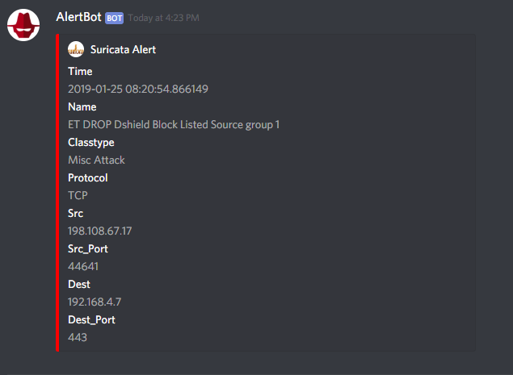
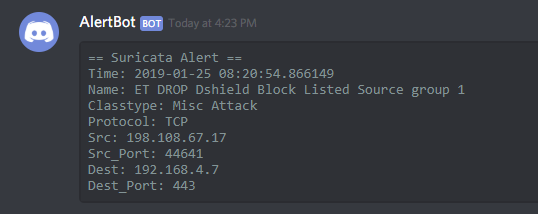
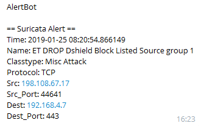

# alertBot

* [Features](#features)
* [Install](#install)  
    * [First run](#first-run)  
* [Config](#configjson)  
* [File State](#filestatejson)  
* [Filter](#filtersjson)  
* [Examples](#examples)  
    * [Example - Suricata fast_log alert](#example-fields-generated-by-parsing-suricata-fast_log-alertsnot-filtered)  
    * [Example - Suricata eve.json alert](#example-fields-generated-by-parsing-suricata-evejson-alertsnot-filtered)  
    * [Example - Discord embeds message](#example-discord-embeds-message)  
    * [Example - Discord General message](#example-discord-general-message)  
    * [Example - Telegram General message](#example-telegram-general-message)  

## Features
* Continuously 'tail' (tail -f like) Snort and Suricata alert log files  
* Tracking (and saves) last read line so you can safely stop the program without reading old alerts later
* Send parsed alerts as a notification via Telegram, Discord, Webhook  
* Alert filtering capabilities - Throwaway those noisy alerts  
    * Filter stats which also includes not filtered alerts   
* Automatically restart program when certain files changes (you choose which files to watch)  
* Reverse DNS to 'enrich' source and destination IP info  
## Install
Requires python 3.7.x and pip/pipenv. Pipenv is recommended
```bash
git clone https://github.com/nockstarr/alertBot.git  # Or download zip
pip install pipenv
cd alertBot
# Install dependencies using a virtual enviorment
pipenv install
```
> If you don't want to use pipenv, check [packages] in Pipfile -> 'pip install <package>'

Copy example config and filter 
```bash
cp example_config.json config.json
cp example_filter.json filter.json
```
Edit `config.json` and `filter.json`  
Active virtual environment (only when using pipenv) `pipenv shell`  
Start bot `python alertBot.py`  

Following argument(s) are supported and overrides config.json    
* Override log level `python alertBot.py info|warn|critical|error|debug`  
### First run  
The first time you run this 'bot' and your alert log file is full of alerts you should disable; `reverseDns` and `notify`.
Whenever it's done plowing your logs (it is pretty fast) you can stop the program (`ctrl+c`), and enable reverseDNS and notifications. 
## config.json
Nice2Know
* Config must exist in 'root' ex -> alertBot/
    - congfig path is hard coded in src/__init__py
* General
    - reverseDns: `true|false` - Populates src/dest fields with reverseDNS
    - restartOnChange: `true|false` - Restarts program when changes in 'watchedFiles' is detected
    - watchInterval: Seconds - `watchedFiles` interval
* Logging
    - alertBot is using logging.config.dictConfig for configuration.
    - Refer to logging module [documentation](https://docs.python.org/3.7/library/logging.html) for changes.
* Sensors
    - Suricata
        - logType: `eve|full|fast` - Specify log format
    - Snort
        - logType: `full|fast` - Specify log format
* Notify
    - notifyOnStartUp: `true|false`true|false - Send a notification on startup
    - blackListedFields: `[]` - List of fields. Ignored when sending notifications
    - agents
        - webhook: Posts alert as JSON (without 'filtering' fields) to a web resource
        - discord: Supports embeds (se [Example Discord embeds message](#example-discord-embeds-message))
* PcapParser
    - Experimental. Dont enable this
## fileState.json
Nice2Know
* Generated automatically
* Path is hardcoded in alertBot.py
## filters.json
Nice2Know
* Must exist in 'root' ex -> alertBot/
* filters.json can contain many filters.
* A filter can contain many rules. 
* A filter can contain multiple rules with the same field(field name).
* Filter "logic" is 'implicit AND' with 'implicit OR'.
    - This means that if a filter have two rules, then both rules has to evaluate as true (implicit AND).
    - You can also use multiple rules on the same field, but at lease one rule that uses that field has to evaluate as true v
* Since the filter is stored in JSON format, escape chars must be escaped when regex etc is used.
    - Ex `\d+` should be `\\d+`
* Filters is validated during initialization and errors is logged to file and console. Errors equals program dies..
* Supports all fields an alert generates.
* The following filter rules is supported:
    - contains
    - not contains
    - regex -> Same as 'exactly' just with regex I guess
    - exactly
    - not exactly
    - ip in cidr
    - ip not in cidr
    - startswith
    - endswith

## Examples
#### Example fields generated by parsing Suricata fast_log alerts(not filtered):
```
{'classtype': 'Detection of a Network Scan',
 'dest': '192.168.4.10',
 'dest_port': '80',
 'gid': '1',
 'name': 'MALWARE-CNC URI - known scanner tool muieblackcat',
 'priority': '3',
 'protocol': 'TCP',
 'revision': '4',
 'sid': '21257',
 'src': '157.230.128.187',
 'src_port': '35242',
 'time': '2019-01-25 17:58:03.598388'}
```
> Snort alerts should have the same fields.  
#### Example fields generated by parsing Suricata eve.json alerts(not filtered)  
```
{'action': 'allowed',
 'dest': '192.168.1.1',
 'dest_port': 53,
 'name': 'INDICATOR-COMPROMISE Suspicious .pw dns query',
 'payload': 'AAQBAAABAAAAAAAABGFsZXgCcHcAAAEAAQ==',
 'proto': 'UDP',
 'src': '192.168.1.50',
 'src_port': 51331,
 'time': '2019-01-25 01:02:23.579419'}
```
Payload should be b64.  
Suricata can also have the following fields if available in eve.json:  
 * hostname
 * url
 * http_refer
 * http_method
 * http_user_agent
 
 
#### Example Discord embeds message


#### Example Discord General message


#### Example Telegram General message
